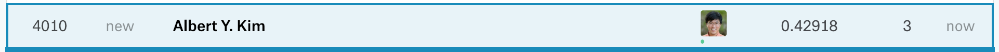

```{r setup, include=FALSE}
# Load all your packages here:
library(tidyverse)
library(scales)

# Set default behavior for all code chunks here:
knitr::opts_chunk$set(
  echo = TRUE, warning = FALSE, message = FALSE,
  fig.width = 16/2, fig.height = 9/2
)

# Set seed value of random number generator here. This is in order to get
# "replicable" randomness, so that any results based on random sampling or
# resampling are replicable everytime you knit this file. Why use a seed value
# of 76? For no other reason than 76 is one of my favorite numbers:
# https://www.youtube.com/watch?v=xjJ7FheCkCU
set.seed(76)
```

You will be submiting an entry to Kaggle's [House Prices: Advanced Regression Techniques](https://www.kaggle.com/c/house-prices-advanced-regression-techniques/){target="_blank"} by fitting a **multiple regression** model $\hat{f}(x)$.


***


# EDA

Read in data provided by Kaggle for this competition. They are organized in the `data/` folder of this RStudio project:

```{r}
training <- read_csv("data/train.csv")
test <- read_csv("data/test.csv")
sample_submission <- read_csv("data/sample_submission.csv")
```

Before performing any model fitting, you should always conduct an exploratory data analysis. This will help guide and inform your model fitting. 

## Look at your data!

Always, ALWAYS, **ALWAYS** start by looking at your raw data. This gives you visual sense of what information you have to help build your predictive models. To get a full description of each variable, read the data dictionary in the `data_description.txt` file in the `data/` folder.

Note that the following code chunk has `eval = FALSE` meaning "don't evaluate this chunk with knitting" because `.Rmd` files won't knit if they include a `View()`:

```{r, eval = FALSE}
View(training)
glimpse(training)

View(test)
glimpse(test)
```

In particular, pay close attention to the variables and variable types in the
`sample_submission.csv`. Your submission must match this exactly.

```{r}
glimpse(sample_submission)
```

## Data wrangling

As much as possible, try to do all your data wrangling here:

```{r}

```


***


# Minimally viable product

## Model fitting

```{r}

```


## Estimate of your Kaggle score

```{r}

```


## Create your submission CSV

```{r}
submission <- sample_submission %>% 
  mutate(SalePrice = mean(training$SalePrice))

write_csv(submission, path = "data/submission_mvp.csv")
```


## Screenshot of your Kaggle score

Our score based on our submission's "Root Mean Squared Logarithmic Error" was 0.42918.

{ width=100% }


## Comparisons of estimated scores and Kaggle scores


***


# Due diligence

## Model fitting

```{r}

```


## Estimate of your Kaggle score

```{r}

```


## Create your submission CSV

```{r}
submission <- sample_submission %>% 
  mutate(SalePrice = mean(training$SalePrice))

write_csv(submission, path = "data/submission_due_diligence.csv")
```


## Screenshot of your Kaggle score

Our score based on our submission's "Root Mean Squared Logarithmic Error" was 0.42918.

{ width=100% }


## Comparisons of estimated scores and Kaggle scores


***


# Reaching for the stars

## Model fitting

```{r}

```


## Estimate of your Kaggle score

```{r}

```


## Create your submission CSV

```{r}
submission <- sample_submission %>% 
  mutate(SalePrice = mean(training$SalePrice))

write_csv(submission, path = "data/submission_reach_for_stars.csv")
```


## Screenshot of your Kaggle score

Our score based on our submission's "Root Mean Squared Logarithmic Error" was 0.42918.

{ width=100% }


## Comparisons of estimated scores and Kaggle scores


***


# Point of diminishing returns

## Model fitting

```{r}

```


## Estimate of your Kaggle score

```{r}

```


## Create your submission CSV

```{r}
submission <- sample_submission %>% 
  mutate(SalePrice = mean(training$SalePrice))

write_csv(submission, path = "data/submission_diminishing_returns.csv")
```


## Screenshot of your Kaggle score

Our score based on our submission's "Root Mean Squared Logarithmic Error" was 0.42918.

{ width=100% }


## Comparisons of estimated scores and Kaggle scores
