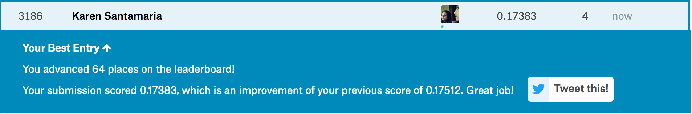

```{r setup, include=FALSE}
# Load all your packages here:
library(tidyverse)
library(scales)
library(MLmetrics)
library(broom)
library(leaps)


# Set default behavior for all code chunks here:
knitr::opts_chunk$set(
  echo = TRUE, warning = FALSE, message = FALSE,
  fig.width = 16/2, fig.height = 9/2
)

# Set seed value of random number generator here. This is in order to get
# "replicable" randomness, so that any results based on random sampling or
# resampling are replicable everytime you knit this file. Why use a seed value
# of 76? For no other reason than 76 is one of my favorite numbers:
# https://www.youtube.com/watch?v=xjJ7FheCkCU
set.seed(76)
```

You will be submiting an entry to Kaggle's [House Prices: Advanced Regression Techniques](https://www.kaggle.com/c/house-prices-advanced-regression-techniques/){target="_blank"} by fitting a **multiple regression** model $\hat{f}(x)$.


***


# EDA

Read in data provided by Kaggle for this competition. They are organized in the `data/` folder of this RStudio project:

```{r}
training <- read_csv("data/train.csv")
test <- read_csv("data/test.csv")
sample_submission <- read_csv("data/sample_submission.csv")
```

Before performing any model fitting, you should always conduct an exploratory data analysis. This will help guide and inform your model fitting. 

## Look at your data!

Always, ALWAYS, **ALWAYS** start by looking at your raw data. This gives you visual sense of what information you have to help build your predictive models. To get a full description of each variable, read the data dictionary in the `data_description.txt` file in the `data/` folder.

Note that the following code chunk has `eval = FALSE` meaning "don't evaluate this chunk with knitting" because `.Rmd` files won't knit if they include a `View()`:

```{r, eval = FALSE}
View(training)
glimpse(training)

View(test)
glimpse(test)

```


## Data wrangling

As much as possible, try to do all your data wrangling here:

```{r}

training <- training %>% 
  select(Id, GrLivArea, BldgType, SalePrice, OverallQual, HalfBath, Foundation, SaleCondition)

training <- training %>% 
  mutate(log10_SalePrice = log10(SalePrice),
         log10_GrLivArea = log10(GrLivArea)
         )

test <- test %>% 
  mutate(
         log10_GrLivArea = log10(GrLivArea)
         )


```


***

# Minimally viable product


## Model fitting
```{r}
training <- training %>% 
  sample_frac(1) %>% 
  mutate(fold = rep(1:5, length = n())) %>% 
  arrange(fold)

df = data.frame(fold = numeric(0), RMSLE = numeric(0))

model_1_formula <- as.formula("SalePrice~ GrLivArea + BldgType")

  

for(j in 1:5){
  pretend_training <- training %>% 
    filter(fold != j)
  pretend_test <- training %>% 
    filter(fold == j)
    
  # Fit model on pretend training
  model_1 <- lm(model_1_formula, data = pretend_training)
    
  fitted_points_1 <- model_1 %>%
    broom::augment(newdata = pretend_training)
    
  predicted_points_1 <- model_1 %>%
    broom::augment(newdata = pretend_test)
    
  rmsle_hat = MLmetrics::RMSLE(y_pred = predicted_points_1$.fitted, y_true = predicted_points_1$SalePrice)
    
  df[nrow(df) + 1,] = list(j,rmsle_hat)

}
```


***


# Due diligence

## Estimate of your Kaggle Score
```{r}
mean(df$RMSLE)
```


## Create your submission CSV

```{r}

predict_test <- model_1 %>%
  broom::augment(newdata = test)


submission <- test %>% 
  mutate(SalePrice = predict_test$.fitted) %>%
  select(Id,SalePrice)


write_csv(submission, path = "data/submission_due_diligence.csv")
```


## Screenshot of your Kaggle score

Our score based on our submission's "Root Mean Squared Logarithmic Error" was 0.28756

{ width=100% }


## Comparisons of estimated scores and Kaggle scores

Our estimated score was 0.2718804 and our score on Kaggle was 0.28756 which is fairly close.


***


# Reaching for the stars


## Model fitting

```{r}
training <- training %>% 
  sample_frac(1) %>% 
  mutate(fold = rep(1:5, length = n())) %>% 
  arrange(fold)

df2 = data.frame(fold = numeric(0), RMSLE = numeric(0))
model_2_formula <- as.formula("log10_SalePrice~ log10_GrLivArea + BldgType + OverallQual + HalfBath + Foundation + SaleCondition")

  

for(j in 1:5){
  pretend_training <- training %>% 
    filter(fold != j)
  pretend_test <- training %>% 
    filter(fold == j)
    
  # Fit model on pretend training
  model_2 <- lm(model_2_formula, data = pretend_training)
    
  fitted_points_2 <- model_2 %>%
    broom::augment(newdata = pretend_training)
    
  predicted_points_2 <- model_2 %>%
    broom::augment(newdata = pretend_test)
  
  pretend_test <- pretend_test %>% 
    mutate(
      log10_SalePrice_hat = predicted_points_2$.fitted,
      SalePrice_hat = 10^log10_SalePrice_hat
    )
    
  rmsle_hat = MLmetrics::RMSLE(y_pred = pretend_test$SalePrice_hat, y_true = pretend_test$SalePrice)
    
  df2[nrow(df2) + 1,] = list(j,rmsle_hat)

}
```


## Estimate of your Kaggle score

```{r}
mean(df2$RMSLE)
```


## Create your submission CSV

```{r}
predict_test2 <- model_2 %>%
  broom::augment(newdata = test)

submission <- test %>% 
  mutate(
    log10_SalePrice = predict_test2$.fitted,
    SalePrice = 10^log10_SalePrice
    ) %>%
  select(Id,SalePrice)


write_csv(submission, path = "data/submission_reach_for_stars.csv")
```


## Screenshot of your Kaggle score

Our score based on our submission's "Root Mean Squared Logarithmic Error" was 0.17383

{ width=100% }


## Comparisons of estimated scores and Kaggle scores

Our predicted RMSLE was 0.18211 and our actual score from Kaggle was 0.17383 which is fairly close to our predicted score.


***


# Point of diminishing returns 


```{r, include=FALSE}
na.omit(training)
```


Find subset with largest adjusted R^2 for best subset selection
```{r}
regfit.full<-regsubsets(model_2_formula,data=training, nvmax=6) 
reg.summary=summary(regfit.full)

plot(reg.summary$adjr2 ,xlab="Number of Variables ", ylab="Adjusted RSq",type="l")

which.max(reg.summary$adjr2)
points(6,reg.summary$adjr2[6], col="red",cex=2,pch=20)
coef(regfit.full, 6)
```

Find subset with smallest adjusted RSS for best subset selection
```{r}
plot(reg.summary$rss ,xlab="Number of Variables ", ylab="RSS",type="l")

which.min(reg.summary$rss)
points(6,reg.summary$rss[6], col="red",cex=2,pch=20)
```


Given that the subset was the model that contained all the variables for model_2, we know that the predicted RMSLE for the best subset of predicter variables is the same as the predicted RMSLE for model_2. 


## Estimate of your Kaggle score


Same as prediction for model_2 RMSLE
```{r}
mean(df2$RMSLE)
```


## Create your submission CSV


```{r}
predict_test2 <- model_2 %>%
  broom::augment(newdata = test)

submission <- test %>% 
  mutate(
    log10_SalePrice = predict_test2$.fitted,
    SalePrice = 10^log10_SalePrice
    ) %>%
  select(Id,SalePrice)


write_csv(submission, path = "data/submission_diminishing_returns.csv")
```


## Screenshot of your Kaggle score

Our score based on our submission's "Root Mean Squared Logarithmic Error" was 0.17383


{ width=100% }


## Comparisons of estimated scores and Kaggle scores

Our predicted RMSLE was the same as for model_2 which was 0.18211 and our actual score was the same score we got from Kaggle for model two which was 0.17383 which is fairly close to our predicted score.
